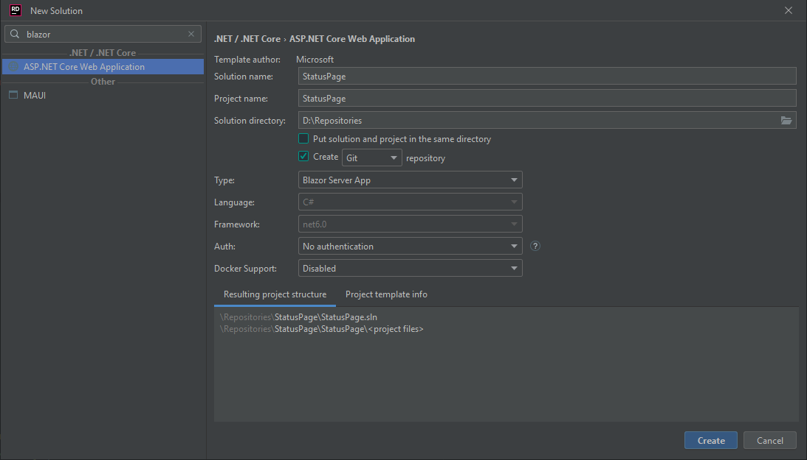
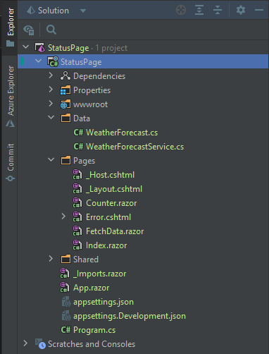
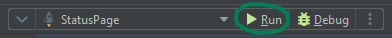
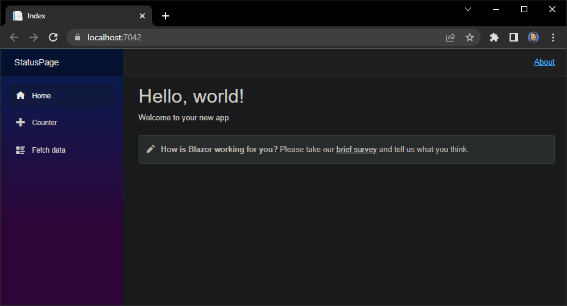
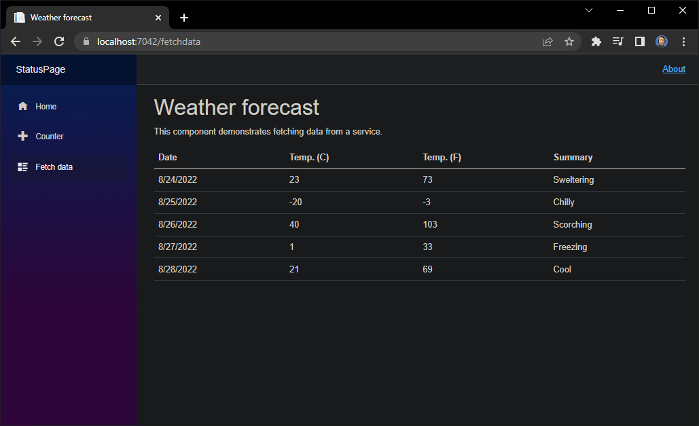
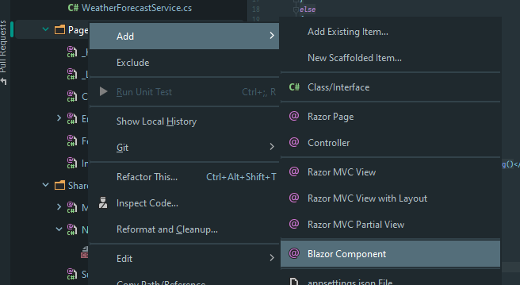
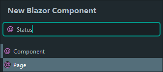
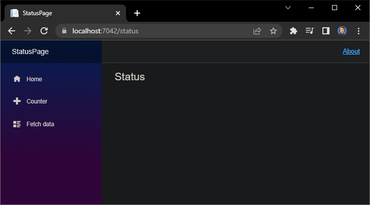
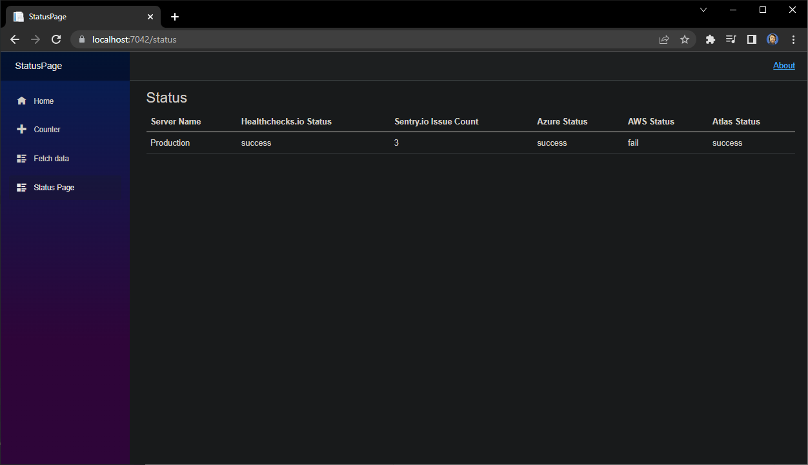

# Introduction to Microsoft Blazor - Building a Status Page

Have you ever build an application that consisted of multiple different systems that you had to observe and make sure they run properly?
Some services might offer sending notifications, like MongoDB Atlas or Microsoft Azure App Service.
Not always will they offer all the channels you'd want to use though, like Slack or Discord.
One of the many approaches to always keep track of all the system statuses is to create a status page that lets you see an overview of all systems at once.

This is what this tutorial will be dedicated to. There are several parts to it, each of them being it's own, small lesson on a specific topic.
Go ahead and jump into the one you are interested in, they are more or less independent of each other.

The series consists of the following parts:
- Part #1: Introduction to Blazor - Creating a simple Web App *(this tutorial)*
- Part #2: Sync Status Data with MongoDB Atlas *(coming soon)*
- Part #3: Retrieve status from healthchecks.io
- Part #4: Retrieve status from sentry.io
- Part #5: Retrieve status from MongoDB Atlas
- Part #6: Retrieve status from Microsoft Azure App Service
- Part #7: Retrieve status from Amazon Web Services

In this first part we will have a look at Blazor, how to create a new Blazor app, create a new page and a very simple, static status page.
Each successive part will then be dedicated to step by step make the status page more dynamic and actually retrieve the data that we need.

All the code shown in this tutorial can be found in our Github repo at https://github.com/mongodb-developer/status-page-blazor-server-app.

## Pre-requisites

Before we can actually start, let's point out what you should take care of before starting with the tutorial.

For this part specifically we need:
- [Download and install the .NET SDK](https://dotnet.microsoft.com/en-us/download)
- Download and Install an IDE of your choice like [Microsoft Visual Studio](https://visualstudio.microsoft.com/downloads/) or [JetBrains Rider](https://www.jetbrains.com/rider/download/#section=windows)

Note that I am using Rider for this tutorial.
If you use Visual Studio or another IDE some terms might be slightly different or menus might be in a different location.

## Architecture

The architecture of the final result is not overly complicated but to give you a quick overview right at the start, lets look into all the components involved.


The status page and it's services will be built using Blazor.
The deployment will then be done using the Microsoft Azure App Service which hosts the status page on Azure.

The status page retrieves the information about the systems we are interested in via MongoDB Atlas.

Each status is checked by an independent microservice that could theoretically deployed individually.
For the sake of making this tutorial as easy to understand as possible and focusing on the important bits we will however keep everything in one Blazor app for now.

## Create a new project

Let's start by creating a new project!
The Blazor Server App template already contains a good basic structure that we can re-use to create our status page on top of it and also learn the basics of using Blazor at the same time.
Great, isn't it?

Depending on your IDE of choice you want to choose `Blazor Server App` ([Microsoft Visual Studio 2022](https://dotnet.microsoft.com/en-us/learn/aspnet/blazor-tutorial/create)) or `ASP.NET Core Web Application` (JetBrain Rider - as can be seen in the screenshot)



Alternatively, if you prefer to work with the terminal, create a new Blazor Server app by calling:
```
dotnet new blazorserver -o StatusPage
```

In this tutorial we will work with JetBrains Rider but all three of those options will create the same project structure.



Before we actually change anything, go ahead and run the app to get an idea of what we start with.



The result should look something like this:



## Set up the UI for the Status Page

If you have successfully started and seen the `Hello, world!` template example you're ready to start into creating the actual status page.

Let's first create a simple yet information packed page that will later on hold all we need on one single page.

Since this tutorial focuses on the backend side of things, we will not spend too much time with the UI. In fact, the template already provides something similar to what we are looking for and you can use it as a reference if your HTML is as rusty as mine!

Have a look at the `Fetch data` page of the template:



Let's start by adding a new `Razor Page` to our `Pages`:



Call the new page `Status` and choose the type `Page`:



The newly created file will contain a couple things.
The keyword `@page` let's Blazor know which link to generate to actually access the page.
If you restart your app (or hot reload) you can now access `https://localhost:7042/status`.

Blazor automatically added the title as an h3 tag into the file as well along with a code block that needs to be filled out by us.

Another convenient feature is that the menu bar is automatically embedded, the new page is missing though.



When the project was created, the file `Shared/NavMenu.razor` was added as well.
If you jump into it you will see the three menu items `Home`, `Counter` and `Fetch data`, each in their own div element containing a `NavLink`.

All we need to do here is add another link within the `nav` block:

```html
<div class="nav-item px-3">
    <NavLink class="nav-link" href="status">
        <span class="oi oi-list-rich" aria-hidden="true"></span> Status Page
    </NavLink>
</div>
```

The file should then look like this:

```html
<div class="top-row ps-3 navbar navbar-dark">
    <div class="container-fluid">
        <a class="navbar-brand" href="">StatusPage</a>
        <button title="Navigation menu" class="navbar-toggler" @onclick="ToggleNavMenu">
            <span class="navbar-toggler-icon"></span>
        </button>
    </div>
</div>

<div class="@NavMenuCssClass" @onclick="ToggleNavMenu">
    <nav class="flex-column">
        <div class="nav-item px-3">
            <NavLink class="nav-link" href="" Match="NavLinkMatch.All">
                <span class="oi oi-home" aria-hidden="true"></span> Home
            </NavLink>
        </div>
        <div class="nav-item px-3">
            <NavLink class="nav-link" href="counter">
                <span class="oi oi-plus" aria-hidden="true"></span> Counter
            </NavLink>
        </div>
        <div class="nav-item px-3">
            <NavLink class="nav-link" href="fetchdata">
                <span class="oi oi-list-rich" aria-hidden="true"></span> Fetch data
            </NavLink>
        </div>
        <div class="nav-item px-3">
            <NavLink class="nav-link" href="status">
                <span class="oi oi-list-rich" aria-hidden="true"></span> Status Page
            </NavLink>
        </div>
    </nav>
</div>

@code {
    private bool collapseNavMenu = true;

    private string? NavMenuCssClass => collapseNavMenu ? "collapse" : null;

    private void ToggleNavMenu()
    {
        collapseNavMenu = !collapseNavMenu;
    }

}
```

Now on to the final step, the actual content of the status page.
As mentioned before, a simple table like in `Fetch data` will do for this tutorial.
To create a table with some stub data in the structure we need later, add the following code just below the `h3` tag in `Status.razor`:

```html
<table class="table">
    <thead>
    <tr>
        <th>Server Name</th>
        <th>Healthchecks.io Status</th>
        <th>Sentry.io Issue Count</th>
        <th>Azure Status</th>
        <th>AWS Status</th>
        <th>Atlas Status</th>
    </tr>
    </thead>
    <tbody>
    <tr>
        <td class="td">Production</td>
        <td class="td">success</td>
        <td class="td">3</td>
        <td class="td">success</td>
        <td class="td">fail</td>
        <td class="td">success</td>
    </tr>
    </tbody>
</table>
```

Our final (mocked) status page for this tutorial:



## Your turn!

While this was just a first step in creating the status page, we've got our first layer done, the UI!

Now it's time for you to head over to https://github.com/mongodb-developer/status-page-blazor-server-app and download the code for this tutorial and play around whith it.
Kudos if you've coded along right away!
Change the look of the status page, add more pages or head over to the [Blazor documentation](https://dotnet.microsoft.com/en-us/apps/aspnet/web-apps/blazor) to find out even more about it.

If you have any questions at any point, please tweet [@dominicfrei](https://twitter.com/dominicfrei) or come visit us in the [MongoDB Developer Community Forums](https://www.mongodb.com/community/forums/)!
